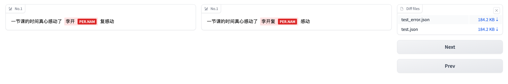

### Flat NER diff visual tool



### Requirement

python==3.10.0
``` bash
pip install -r requirements.txt
```

### Run

```bash
gradio main.py
# Running on local URL:  http://127.0.0.1:7860
#
# To create a public link, set `share=True` in `launch()`.
```

### License

MIT